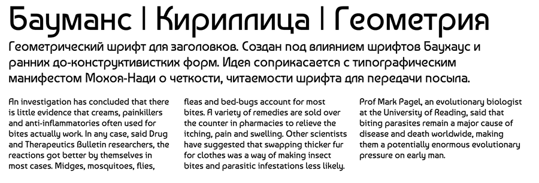

Кириллическая версия шрифта Бауманс.
Дизайнер: Генадий Заречнюк

Cyrillic version of Baumans. 

Baumans is a geometric typeface for headlines.
Its letterforms are inspired by Bauhaus typefaces
and preconstructivist forms.

The concept of the typeface fits with
Moholy-Nagy's typography statement that type
must be clear, legible, and communicate its message.

The main distinctive features are the 
sharp corners in MVW, curved Z and unicase-like N.
Contrast is monolinear and proportions are balanced.

Baumans is suitable for medium to large sizes and optimized for screen.

Designed by Henadij Zarechnjuk.

Baumans Cyrillic is a Unicode typeface family that supports 
languages that use the Latin and Cyrillic script and its variants, and 
could be expanded to support other scripts.

